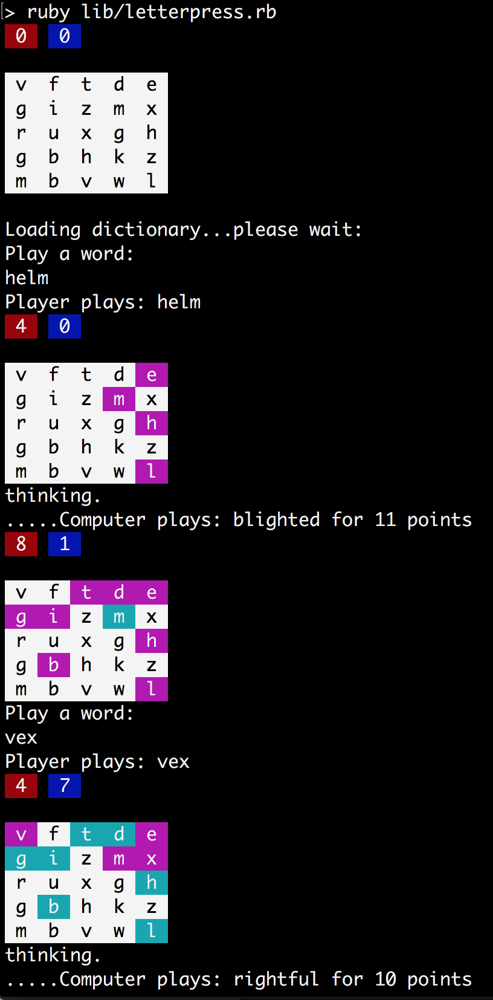
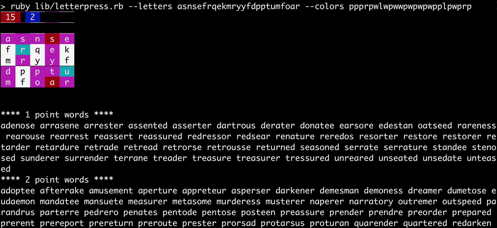
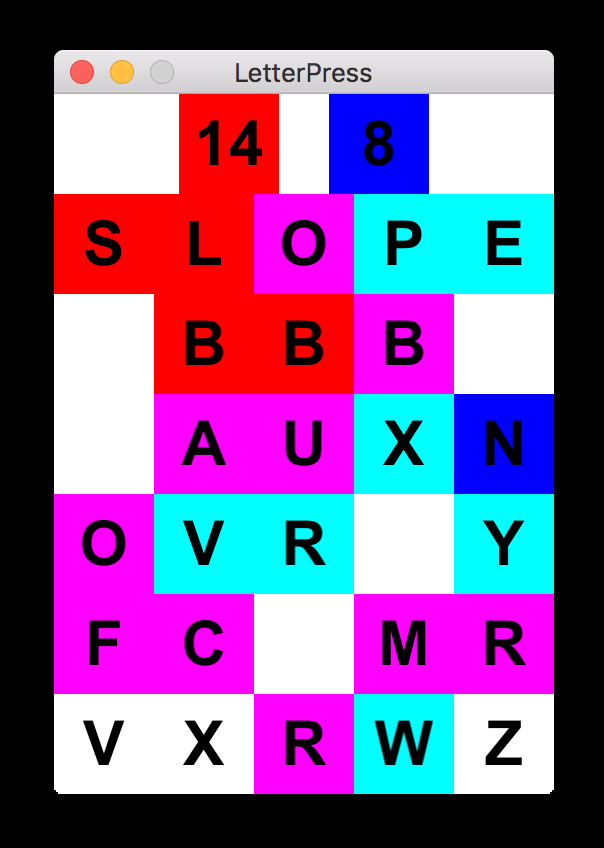

# letterpress

A fun toy project to see how well I can simulate the state of a [Letterpress](https://itunes.apple.com/us/app/letterpress-word-game/id526619424?mt=8) game board.

## Usage:

    ruby lib/letterpress.rb [options]

## Options:

    --help,     -h (shows this usage message)
    --letters,  -l [letters on the board starting from the top-right corner]
    --colors,   -c [colors on the board: r=red, p=pink, l=lightblue, d=darkblue, w=white]
    --require,  -r [letters required in the hint results]

## Examples:

    # setup board from input and provide suggestions for possible moves
    ruby lib/letterpress.rb --letters lbbbesauxnovrpyfcomrvxrwz --colors rrrplrppldpllllpppppwwplw

    # start a new game from scratch and play against the computer
    ruby lib/letterpress.rb

    # start up a new game using the [Gosu](https://www.libgosu.org/) Ruby game engine (warning, still needs a lot of work)
    ruby lib/gosu.rb

## Screenshots:

### VS the Computer

### Cheat Mode

### Gosu Board Interface

## Limitations:

* Currently uses MacOS' dictionary at `/usr/share/dict/words` to make words, which may not count in a real game.
* If a letter can be chosen from many places on the board, it will pick the one that would give the best score advantage, all things equal it will pick the first one on the board, this may interfere with a strategy to cluster letters together to make solid red or blue tiles.
* Random board generator doesn't take letter frequency into account. It is possible to have a board with no way to win (for example, letter Q with no U).
* There are many bugs and incomplete features. Still a blast to play with.
